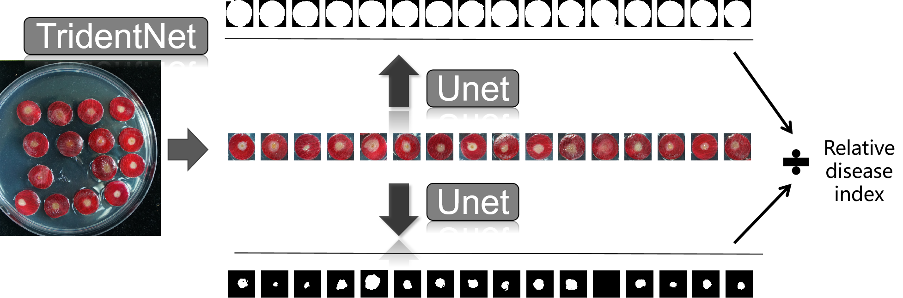

##  Deep Learning Model for Rose Petal Disease Detection

This project focuses on detecting diseases in rose petals using deep learning techniques.


### Usage
1. Clone the repository: `git clone URL_ADDRESS.com/your-username/rose-petal-disease-detection.git`
2. Install the required dependencies: `pip install -r requirements.txt`
you can use the following command to run the main script:
```bash
python app.py
```


### Notes: This project is still under development.
- √ e has been designed.
- √ Model Training has been completed.
- √ The desktop application is under development.
if you have any questions, please contact me at [1647721078@qq.com]
