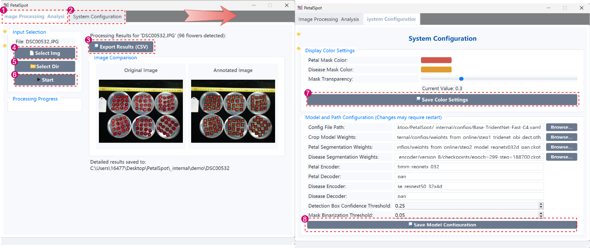

# PetalSpot Pro - Intelligent Petal Disease Analysis System

## 📖 Project Overview

**PetalSpot Pro** is an intelligent petal disease analysis system based on deep learning, designed for the detection and quantitative analysis of rose petal diseases. Combining object detection (TridentNet) and semantic segmentation technologies, this system can automatically identify petals from images, segment disease areas, and accurately calculate the disease area ratio, providing a powerful tool for plant pathology research and agricultural production.

## ✨ Key Features

- **Intelligent Detection & Cropping**: Utilizes the TridentNet object detection model to automatically locate and crop petal regions in images.
- **High-Precision Segmentation**: Employs advanced segmentation networks (RegNet + U-Net/Manet) to extract petal masks and disease area masks respectively.
- **Quantitative Analysis**:
  - Automatic calculation of petal area (pixels).
  - Automatic calculation of disease area (pixels).
  - Precise output of disease ratio (%).
- **Batch Processing**: Supports single image analysis and batch folder processing, significantly improving efficiency.
- **Visualized Results**: Provides result images with detection boxes, segmentation masks, and data annotations.
- **Data Export**: Supports exporting analysis results to CSV tables for subsequent statistical analysis.
- **User-Friendly Interface**: A graphical interface developed based on PyQt5, supporting full-screen viewing, zooming, panning, and other operations.

## 🖼️ Software Screenshot

*The main interface shows image loading, analysis control, and result preview functions.*

## 📥 Download & Models

You can download the packaged executable software (PetalSpot) and pre-trained model weights from Google Drive. This is the easiest way to get started without setting up a Python environment.

- **Google Drive Link**: [Download PetalSpot & Models](https://drive.google.com/open?id=16qvfvMt3wYPZVF5-S2SGeXUEf53NvpSc&usp=drive_fs)

The download package includes:
- `PetalSpot.exe`: The main application executable.
- `configs/`: Contains the configuration files and pre-trained model weights:
    - `step1_tridenet_obj_dect.pth` (Object Detection)
    - `step2_model_regnetx032d_pan.ckpt` (Petal Segmentation)
    - `step3_model_se_regnety064d_pan.ckpt` (Disease Segmentation)

> **Note for Developers**: If you are running the source code from this repository (`app.py`), you still need to download the model weights from the link above and place them in the `configs/model/` directory (or update the path in "System Settings").

## 🧠 Model Architecture

This project adopts a cascaded deep learning processing flow:
1. **Stage 1 (Object Detection)**: Uses TridentNet to quickly locate petal positions.
2. **Stage 2 (Semantic Segmentation)**: Performs fine segmentation on the cropped petals to extract petal contours and disease areas.

